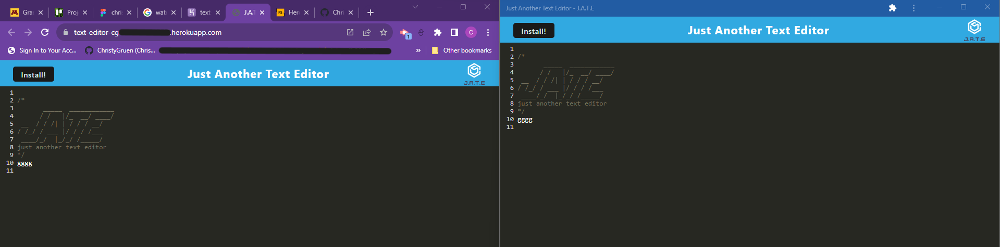

  # PWA Text Editor

  ## Description
  
The PWA text editor will be a single-page application that can run in the browser and can be downloaded and used offline.

  ## Table of Contents
  [Installation Instructions](#installation-instructions) 
  [Usage](#usage) 
  [License](#license) 
  [Contributors](#contributors) 
  [Tests](#tests) 
  [Questions](#questions) 
  [References](#references) 

  
  ## Installation Instructions
  
To install the required packages to run this app locally, navigate to the root directory of the project and open an integrated terminal.  Type <strong> npm i -y</strong> in the terminal and enter.  This will install the packages listed in the package manager

  ## Usage
  
To run the app locally, type "npm run start" in the terminal and enter.  Go to your local server and type localhost:3000 in the address bar.
  
  ## License
 none

  ## Contributors
  ChristyGruen at <https://github.com/ChristyGruen>
      
  #### How to Contribute
To contribute to the app: fork the repo on GitHub, then clone the project to your own machine.  Update the code, commit your changes to your own branch, then push your work to your fork on GitHub. Finally, submit a Pull request for review.

  ## Tests
none

  ## Questions
  For further information, access my gitHub profile here:
  <https://github.com/ChristyGruen>
   
  For questions, comments and concerns, please log an issue at: :
  <https://github.com/ChristyGruen/ChristyGruen/issues>

  ## References
Source code provided by Gary Almes, Full Stack Bootcamp Instructor.
  